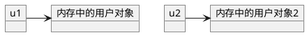
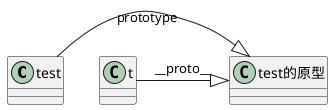

```puml
@startuml
object 内存中的用户对象
object u1
object u2
object 内存中的用户对象2
u1 -> 内存中的用户对象
u2 -> 内存中的用户对象2
@enduml
```

```puml
@startuml
test -|> test的原型: prototype
t -|> test的原型: __proto__
@enduml
```